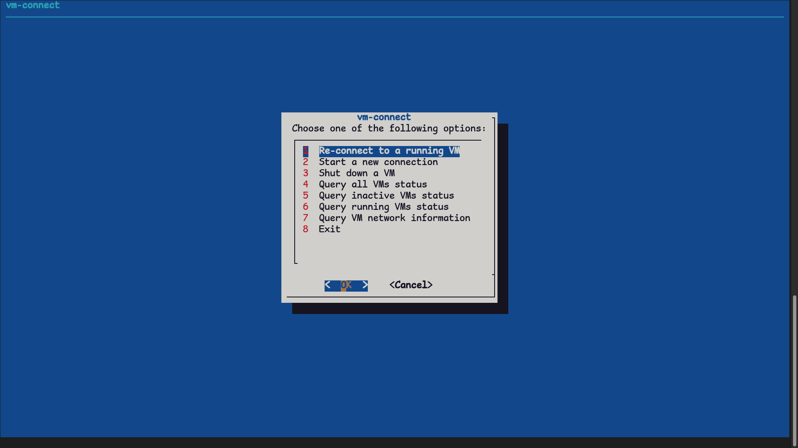

# looking-glass-client-script
A basic bash script to use Looking Glass and connect to VMs with Looking Glass setup.

## Requirements

- Looking Glass installation
- Requires `looking-glass-client` to be installed (and executable by running looking-glass-client - cannot be portable) (If you want to change the script to work with a different setup, go ahead.)
- Requires Looking Glass to be previously setup inside your virtual machine. (Follow the official docs [here](https://looking-glass.io/docs/B6/))
- 'dialog' package installed. Included in most distros by default. 

If you have problems with mouse cursor & odd behaviour with cursors. Remove the "tablet" from the VM. This can be done inside of Virtual Machine Manager.

## Installation

Clone the git contents using `git clone`.

```bash
git clone https://github.com/msinfo32github/looking-glass-client-script/
```
Change directory into the newly downloaded folder.

```bash
cd looking-glass-client-script
```

List the files inside the directory.

```bash
ls
```

Inside the folder you will see the following.

```bash
README.md  vm-connect-old-cli-only.sh  vm-connect.sh*
```

Set file(s) to be executable.

```bash
chmod +x vm-connect-old-cli-only.sh
```

```bash
chmod +x vm-connect.sh
```

There are two scripts, `vm-connect-old-cli-only.sh` and `vm-connect.sh`.

`vm-connect-old-cli-only.sh` and `vm-connect.sh`

The preferred script is `vm-connect.sh`, as it has a CLI-based GUI using 'dialog'
(If you enter a VM name that does not exist, it will attempt to reconnect to a running VM instead.)



The original script is `vm-connect-old-cli-only.sh`. It is entirely CLI based and does not have a CLI-based GUI. It only has the function to give you a list of what VMs you have, and allows you to select one to start & connect to.

### Install to `/usr/bin`

You can install this to `/usr/bin` very easyily. This allows you to execute this from anywhere within a terminal, as any normal CLI application.

```bash
sudo cp vm-connect.sh /usr/bin/vm-connect
```
You are likely to need to use sudo, if you know you do not, then do not use sudo.
Replace the name with which one you would would prefer to use.

(Do not put the `.sh` extension on the right side, as you do not need this.)

You can now execute the script by running the following.

```bash
vm-connect
```

## Uninstall

You can easily uninstall by removing the files.

If you have not added it to `/usr/bin` you can delete the files whereever they are stored.

This is done by running the following command.

```bash
rm vm-connect.sh
```

If you have installed it to `/usr/bin` you can use the following command.

```bash
sudo rm /usr/bin/vm-connect
```

You are likely to need to use sudo, if you know you do not, then do not use sudo.

## Usage

Use the keyboard and mouse, using the arrow keys and enter to select menus. This is like any other CLI-GUI based application.
